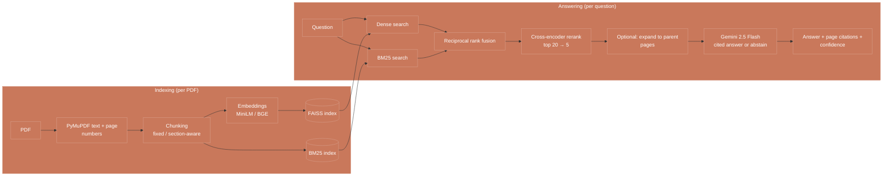
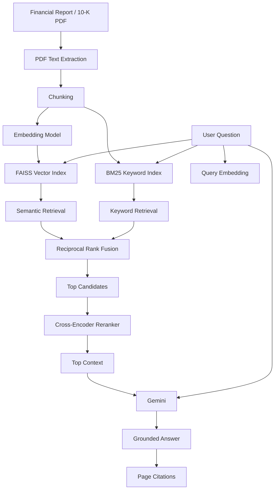

# AuditIQ — AI-Assisted Financial Document Intelligence

**AuditIQ** is a Retrieval-Augmented Generation (RAG) system for asking natural-language questions over financial reports, annual reports, and 10-K filings.

## Architecture


It combines **semantic retrieval, keyword retrieval, reranking, and LLM-based generation** to produce answers grounded in the source document with page-level citations.

---

## Overview

Financial reports are long, highly structured documents containing narrative text, financial terminology, tables, and cross-references.

AuditIQ converts these documents into searchable representations and builds a retrieval pipeline that can identify the most relevant evidence before sending it to an LLM.

The system supports experimentation with different:

- Chunking strategies
- Embedding models
- Retrieval methods
- Reranking configurations
- Retrieval depths

The pipeline is evaluated independently before being used for end-to-end answer generation.

---

## Architecture



### Pipeline

**Indexing**

1. **PDF → Text**  
   PyMuPDF extracts text page-by-page while preserving page metadata.

2. **Text → Chunks**  
   Documents are split into retrieval units using configurable chunking strategies.

3. **Chunks → Embeddings**  
   Each chunk is converted into a dense vector representation using a HuggingFace embedding model.

4. **Embeddings → FAISS**  
   Vectors are stored in an in-memory FAISS index for semantic similarity search.

5. **Chunks → BM25**  
   A BM25 keyword index is built alongside FAISS to support exact-term retrieval.

**Querying**

1. The user question is embedded using the same embedding model.
2. FAISS retrieves semantically similar chunks.
3. BM25 retrieves keyword-relevant chunks.
4. Reciprocal Rank Fusion combines the retrieval results.
5. A cross-encoder can rerank the highest-ranked candidates.
6. The strongest evidence is passed to Gemini.
7. Gemini generates a grounded answer using the retrieved context.
8. Source metadata is converted into page-level citations.

---

## Key Features

### 📄 Financial Document QA

Upload an annual report or 10-K PDF and ask questions in natural language.

### 🔎 Hybrid Retrieval

AuditIQ combines:

- **FAISS** for semantic similarity
- **BM25** for exact keyword matching

This allows the system to handle both conceptual questions and queries involving specific financial terminology, company names, metrics, or numbers.

### 🧩 Configurable Chunking

The retrieval pipeline supports multiple chunking strategies, including:

- Whole-page chunks
- 500-character chunks
- 800-character chunks
- 1200-character chunks
- Section-aware chunking

This allows retrieval quality to be compared experimentally rather than assuming one chunking strategy is universally optimal.

### 🎯 Reranking

A cross-encoder can rerank the highest-retrieved candidates before generation.

The retrieval pipeline therefore separates:

**candidate retrieval → relevance reranking → final context selection**

### 📚 Source-Cited Answers

Generated answers are grounded in retrieved document excerpts and mapped back to their source pages.

### ⚠️ Retrieval Confidence

The system can flag questions where retrieval evidence is weak instead of treating every generated response as equally reliable.

### 📊 RAG Evaluation

The project includes an evaluation pipeline for measuring retrieval and generation quality using metrics such as:

- Faithfulness
- Answer relevancy
- Context recall

---

## Retrieval Experiments

AuditIQ includes an ablation-based approach to selecting the retrieval configuration.

Instead of choosing a configuration arbitrarily, different combinations of retrieval components can be compared experimentally.

### Variables

| Component | Configurations |
|---|---|
| Chunking | Page / 500 / 800 / 1200 chars / Section-aware |
| Embeddings | MiniLM / BGE |
| Retrieval | FAISS / BM25 / Hybrid |
| Reranking | Enabled / Disabled |
| Retrieval depth | Configurable |

The ablation focuses on the retrieval stage without making Gemini generation calls, allowing retrieval configurations to be evaluated independently.

---

## Parent-Page Retrieval

One of the next retrieval experiments is **parent-page retrieval**.

Instead of passing only a small retrieved chunk to the LLM:

```text
Small chunk → retrieve
                 ↓
              parent page
                 ↓
              Gemini
```

This aims to combine the precision of small retrieval units with the broader context available from the original page.

The goal is to reduce the risk of retrieving a highly relevant sentence while losing the surrounding information required to correctly interpret it.

---

## Project Structure

```text
auditiq/
│
├── app.py                  # Streamlit application
├── rag_engine.py           # RAG pipeline and answer generation
├── evaluator.py            # RAG evaluation / experiments
├── list_models.py          # Available model inspection
├── requirements.txt        # Python dependencies
├── .gitignore
└── README.md
```

---

## Tech Stack

| Technology | Purpose |
|---|---|
| Python | Core implementation |
| LangChain | LLM/RAG orchestration |
| Gemini | Answer generation |
| FAISS | Dense vector retrieval |
| BM25 | Keyword retrieval |
| HuggingFace | Local embedding models |
| Cross-Encoder | Candidate reranking |
| Ragas | RAG evaluation |
| PyMuPDF | PDF text extraction |
| Streamlit | User interface |

---

## Local Setup

### 1. Clone the repository

```bash
git clone https://github.com/saanvichaudhary/auditiq.git
cd auditiq
```

### 2. Install dependencies

```bash
pip install -r requirements.txt
```

### 3. Configure your API key

Set the Gemini API key as an environment variable:

```bash
export GEMINI_API_KEY="your-api-key"
```

On Windows PowerShell:

```powershell
$env:GEMINI_API_KEY="your-api-key"
```

### 4. Run AuditIQ

```bash
streamlit run app.py
```

---

## How the RAG Pipeline Works

AuditIQ follows two major stages.

### Stage 1 — Indexing

```text
PDF
 ↓
Text Extraction
 ↓
Chunking
 ↓
 ┌───────────────┬───────────────┐
 ↓               ↓
Embeddings       BM25
 ↓               ↓
FAISS            Keyword Index
 └───────────────┬───────────────┘
                 ↓
            Searchable Corpus
```

This stage is performed when the document is loaded.

### Stage 2 — Question Answering

```text
User Question
      ↓
 ┌────┴─────┐
 ↓          ↓
FAISS      BM25
 ↓          ↓
 └────┬─────┘
      ↓
Reciprocal Rank Fusion
      ↓
Top Candidates
      ↓
Cross-Encoder Reranking
      ↓
Best Evidence
      ↓
Gemini
      ↓
Grounded Answer + Citations
```

---

## Design Decisions

### Why hybrid retrieval?

Pure semantic search can miss exact terminology, identifiers, financial metrics, and specific names.

Pure keyword search can miss semantically related passages.

Combining FAISS and BM25 provides both:

**semantic matching + lexical matching**

### Why reranking?

Initial retrieval is optimized for efficiently finding a candidate set.

The cross-encoder is then used to perform a more expensive relevance comparison on a much smaller set of candidates.

This creates a two-stage retrieval architecture:

```text
Fast retrieval
      ↓
Candidate set
      ↓
Expensive relevance scoring
      ↓
Final context
```

### Why FAISS?

FAISS provides efficient dense-vector similarity search and is lightweight enough for experimentation and single-document workloads.

The current implementation keeps the FAISS index in memory. For a production multi-document system, the index could instead be persisted or replaced with a dedicated vector database such as Qdrant, Chroma, or pgvector.

---

## Evaluation Philosophy

The project separates **retrieval evaluation** from **generation evaluation**.

This makes it possible to determine whether a poor answer originates from:

```text
Bad retrieval
     ↓
Bad context
     ↓
Bad answer
```

or from:

```text
Good retrieval
     ↓
Good context
     ↓
Poor generation
```

The ablation experiments therefore focus on improving the retrieval layer before evaluating the complete end-to-end RAG system.

---

## Current Status

- [x] PDF ingestion
- [x] Page-aware text extraction
- [x] Configurable chunking
- [x] Dense embeddings
- [x] FAISS retrieval
- [x] BM25 retrieval
- [x] Hybrid retrieval
- [x] Reciprocal Rank Fusion
- [x] Optional reranking
- [x] Gemini-based generation
- [x] Source/page citations
- [x] RAG evaluation pipeline
- [x] Retrieval ablation experiments
- [ ] Parent-page retrieval
- [ ] Persistent vector database
- [ ] Multi-document corpus management

---

## Why This Project?

AuditIQ is designed as an exploration of **practical RAG engineering**, rather than a basic "PDF chatbot."

The project focuses on understanding how retrieval choices affect answer quality and how an RAG system can be evaluated systematically.

Key areas explored include:

- Retrieval architecture
- Chunking strategies
- Embedding model selection
- Hybrid search
- Reranking
- Retrieval evaluation
- Context quality
- Grounded generation
- Source attribution
- Production-oriented RAG design

---

## Author

**Saanvi Chaudhary**

B.Tech — Electronics & Communication Engineering  
Specialization in Biomedical Engineering

[GitHub](https://github.com/saanvichaudhary)
